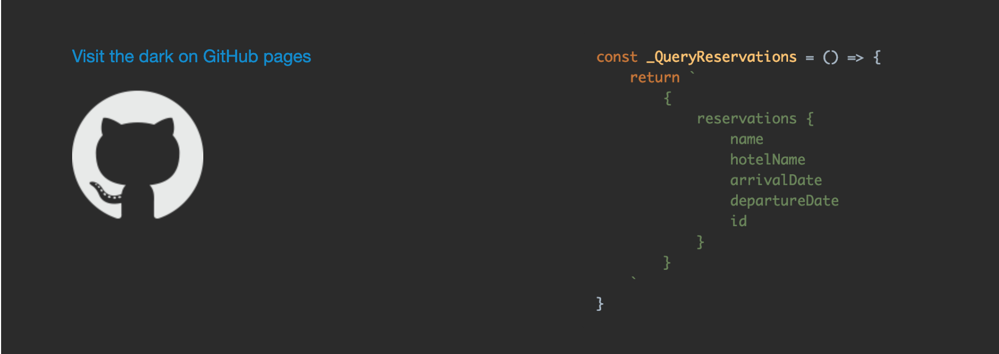
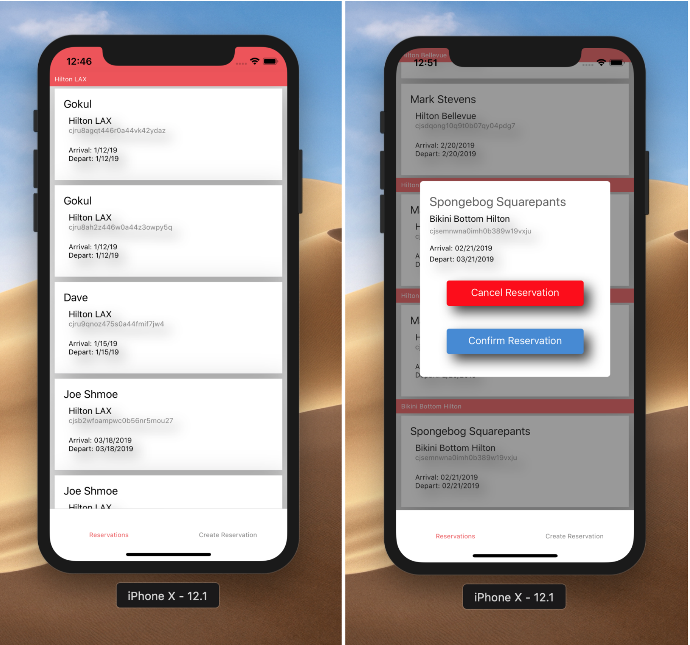
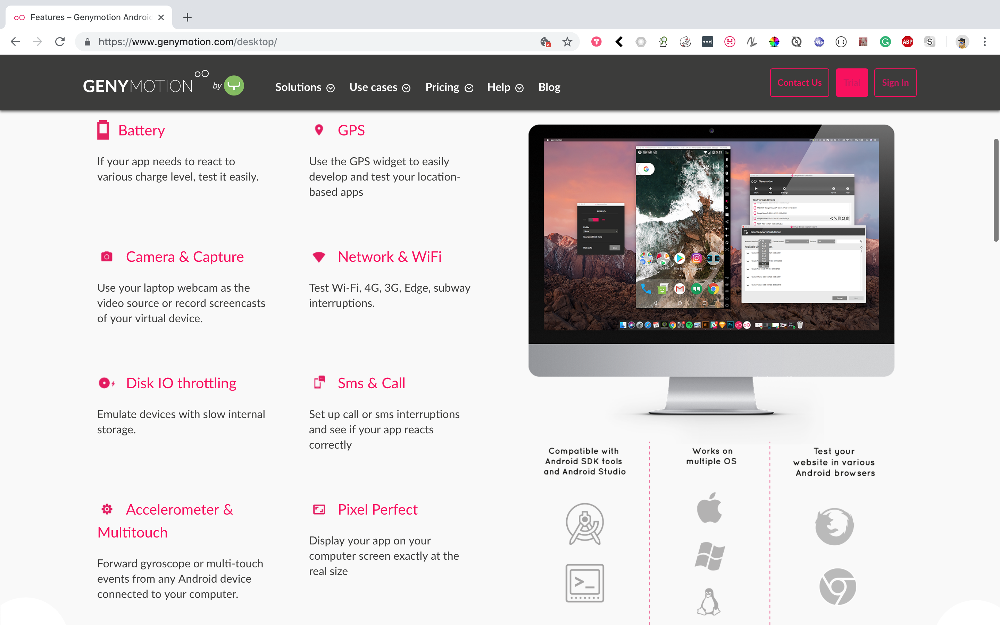
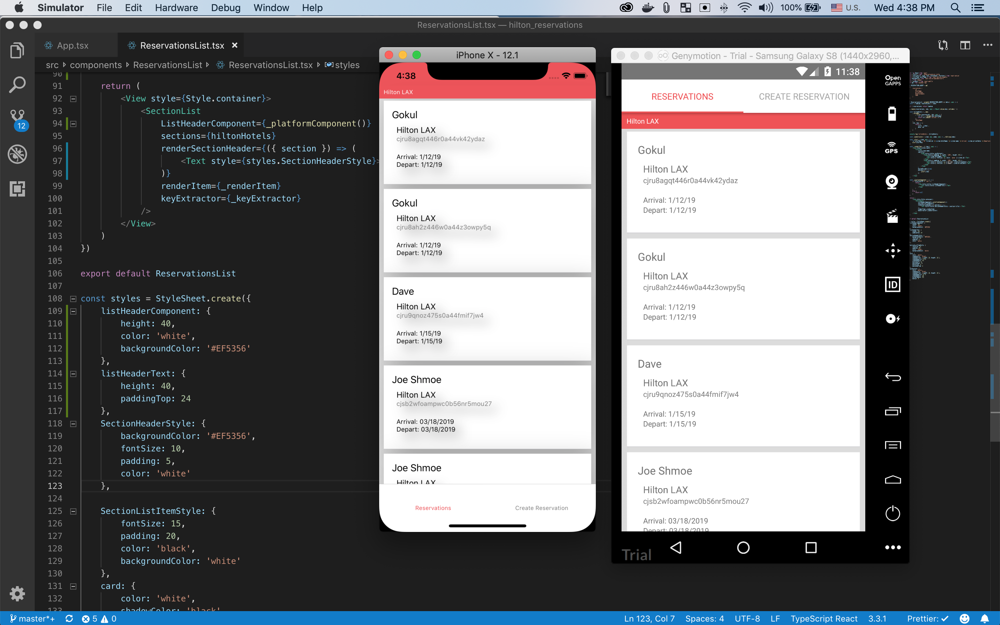

# Hilton Reservations

[](https://flavioespinoza.github.io/hilton_reservations)


<p>................................................................................................</p>

__Pre requesites__
https://facebook.github.io/react-native/docs/getting-started

<p>................................................................................................</p>


## Let's do this


Clone the repo
```bash
git clone https://github.com/flavioespinoza/hilton_reservations.git
```


cd into directory 
```bash
cd hilton_reservations
```


Install with yarn or npm 
```bash
yarn install
```


## Run  on XCode's iPhone emulator
```bash {.copy-clip}
yarn start:ios

"or"

react-native run-ios
```




## Running on a device
The above command will automatically run your app on the iOS Simulator by default. If you want to run the app on an actual physical iOS device, [PLEASE FOLLOW THESE INSTUCTIONS](https://facebook.github.io/react-native/docs/running-on-device)


## Running on an Android emulator

__[Genymotion has the best one for mac folks](https://www.genymotion.com/)__



## After installing Genymotion start a virtual Android device from Genymotion's large selection

When the Android emulator is up and running the app

```bash {.copy-clip}
yarn start:android
```

--

---

# Creating GraphQL queries and mutations with <a href="https://developer.mozilla.org/en-US/docs/Web/JavaScript/Reference/Template_literals" target="_blank">ES6 Template Literals</a>

I love literals :)

```Typescript


NOTE: All files are TypeScript.ts or TypeScript React.tsx

const _QueryReservations = () => {
    return `
        {
            reservations {
                name
                hotelName
                arrivalDate
                departureDate
                id
            }
        }
    `
}

const _MutationCreateReservation = (name: string, hotel: string, arrivalDate: string, departureDate: string) => {
    return `
        mutation {
            createReservation(
                data: {
                    name: "${name}"
                    hotelName: "${hotel}"
                    arrivalDate: "${arrivalDate}"
                    departureDate: "${departureDate}"
                }
            ) 
            {
                id
                name
                hotelName
                arrivalDate
                departureDate
            }
        }
    `
}

export {
    _QueryReservations,
    _MutationCreateReservation,
}

```


### Local State Mgt with React-Native, Apollo-Client, and Template Literal REST Mutations


```typescript

import * as React from 'react'
import MainNavigation from './navigation/MainNavigation/MainNavigaton'
import ApolloClient from 'apollo-boost'
import { InMemoryCache } from 'apollo-cache-inmemory'
import { ApolloProvider } from 'react-apollo'
import { _QueryReservations, _MutationCreateReservation } from './api/query'
import _ from 'lodash'

const TypeMutation =`
    type Mutation {
            createReservation(data: ReservationCreateInput!): Reservation!
            updateReservation(data: ReservationUpdateInput!, where: ReservationWhereUniqueInput!): Reservation
            deleteReservation(where: ReservationWhereUniqueInput!): Reservation
            upsertReservation(
                where: ReservationWhereUniqueInput!
                create: ReservationCreateInput!
                update: ReservationUpdateInput!
            ): Reservation!
            updateManyReservations(data: ReservationUpdateManyMutationInput!, where: ReservationWhereInput): BatchPayload!
            deleteManyReservations(where: ReservationWhereInput): BatchPayload!
        }
    `
const TypeQuery = `
    type Query {
        reservations(
            where: ReservationWhereInput
            orderBy: ReservationOrderByInput
            skip: Int
            after: String
            before: String
            first: Int
            last: Int
        ): [Reservation]!
        reservation(where: ReservationWhereUniqueInput!): Reservation
        reservationsConnection(
            where: ReservationWhereInput
            orderBy: ReservationOrderByInput
            skip: Int
            after: String
            before: String
            first: Int
            last: Int
        ): ReservationConnection!
        node(id: ID!): Node
    }
`
const cache = new InMemoryCache()

const client = new ApolloClient({
    uri: 'https://us1.prisma.sh/public-luckox-377/reservation-graphql-backend/dev',
    cache: cache,
    clientState: {
        defaults: {
            isConnected: true
        },
        resolvers: {
            Query: {
                reservations: () => {
                    return _QueryReservations()
                }
            },
            Mutation: {
                createReservation: async (obj: any) => {
                    const bookReservation = await _MutationCreateReservation(obj.name, obj.hotelName, obj.arrivalDate, obj.departureDate)
                    const timestamp = _.now()
                    const id = `create_reservation_${timestamp}`
                    if (bookReservation) {
                        cache.writeData({ 
                            id: id, 
                            data: bookReservation 
                        })
                    } else {
                        const error_id = `error_create_reservation_${timestamp}`
                        cache.writeData({ 
                            id: error_id, 
                            data: bookReservation 
                        })

                    }
                }
            }
        },
        typeDefs: {
            Mutation: TypeMutation,
            Query: TypeQuery
        }
    }
})

class App extends React.Component {
    render() {
        return (
            <ApolloProvider client={client}>
                <MainNavigation />
            </ApolloProvider>
        )
    }
}

export default App

```

## Results! Android and iOS app with the same codebase!



### Translating GraphQL schemas to TypeScript
_schema.graphql_

```ruby

type Mutation {
    createReservation(data: ReservationCreateInput!): Reservation!
    updateReservation(data: ReservationUpdateInput!, where: ReservationWhereUniqueInput!): Reservation
    deleteReservation(where: ReservationWhereUniqueInput!): Reservation
    upsertReservation(
        where: ReservationWhereUniqueInput!
        create: ReservationCreateInput!
        update: ReservationUpdateInput!
    ): Reservation!
    updateManyReservations(data: ReservationUpdateManyMutationInput!, where: ReservationWhereInput): BatchPayload!
    deleteManyReservations(where: ReservationWhereInput): BatchPayload!
}

```

_schema.ts_

```typescript

const MUTATION = {
    createReservation($data: ReservationCreateInput): Reservation
    updateReservation($data: ReservationUpdateInput, $where: ReservationWhereUniqueInput): Reservation
    deleteReservation($where: ReservationWhereUniqueInput): Reservation
    upsertReservation(
        $where: ReservationWhereUniqueInput,
        $create: ReservationCreateInput,
        $update: ReservationUpdateInput
    ): Reservation
    updateManyReservations($data: ReservationUpdateManyMutationInput, $where: ReservationWhereInput): BatchPayload
    deleteManyReservations($where: ReservationWhereInput): BatchPayload
}

type Mutatation = MUTATION

```


