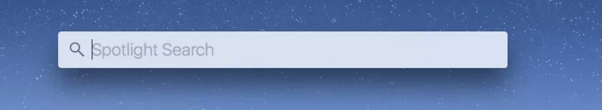
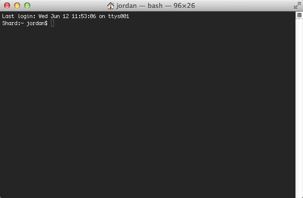

# Setting up React Native development environment

### React Native for iOS does `IS NOT` supported on Windows and Linux

 A `Mac` desktop or `Macbook Pro` laptop is required to build apps using that use native `iOS` code.

### Terminal

All commands and outputs shown in this guide are done inside of the `Terminal`.

<br />

To open the Terminal `hold down` the `Cmd-key` then hit the `Spacebar` to search using `Spotlight`.

<br />



<br />

Type the word `terminal` and hit the `Enter-key`

<br />



You will enter all commands into the `Terminal`.

### Installing dependencies for iOS and Android

> You will need `Xcode`, `Node`, `Watchman` the `React Native CLI`, `Python2`, and a `JDK` (Java Development Kit).

> While you can use the editor of your choice to develop your app, you will need to install `Genymotion` or `Android Studio` in order to set up the necessary tooling to build and run your `React Native` app for `Android`.

> I also reccomend using `Homebrew` to install `Node` and `Watchman`.


### Homebrew

<div class='md-label'>Check if Homebrew is installed.</div>

```bash {.copy-clip}
brew --version
```

<div class='md-label md-label-output'>If Hombrew is installed you will see something similar to the following:</div>

```bash {.copy-clip .md-output}
Homebrew 2.0.5
Homebrew/homebrew-core (git revision 0548; last commit 2019-03-23)
Homebrew/homebrew-cask (git revision 4e0d7; last commit 2019-03-23)
```

If Homebrew `IS NOT` installed use the [Install Homebrew](https://brew.sh/) instructions.


### Xcode

Check if you have Xcode 9.4 or newer installed.

```bash {.copy-clip}
 xcodebuild -version
```

<div class='md-label md-label-output'>Make sure Xcode is version 9.4 or higher.</div>

```bash {.copy-clip .md-output}
Xcode 10.1
```

The easiest way to `install` or `update` `Xcode` is via the [Mac App Store](https://itunes.apple.com/us/app/xcode/id497799835?mt=12). Installing Xcode will also install the iOS Simulator and all the necessary tools to build your iOS app.


### Node

<div class='md-label'>Check if Node version 10 or higher is installed.</div>

```bash {.copy-clip}
node --version
```

<div class='md-label md-label-output'>If you have already installed Node on your system, make sure it is Node 10.0 or newer.</div>

```bash {.copy-clip .md-output}
v11.11.0
```

If Node is not version `10.0` or higher `upgrade` it with Homebrew.

```bash {.copy-clip}
brew upgrade node
```

If Node `IS NOT` installed use Hombrew to install it.

<div class='md-label'></div>

```bash {.copy-clip}
brew install node
```


### Watchman

[Watchman](https://facebook.github.io/watchman) is a tool by Facebook for watching changes in the filesystem. It is highly recommended you install it for better performance.

```bash {.copy-clip}
brew install watchman
```


### Python

<div class='md-label'>Install Python 2</div>

```bash {.copy-clip}
brew install python2
```


### The React Native CLI

Node comes with npm, which lets you install the React Native command line interface.

Run the following command in a Terminal:

<div class='md-label'></div>

```bash {.copy-clip}
npm install -g react-native-cli
```


### Command Line Tools

You will also need to install the Xcode Command Line Tools. Open Xcode, then choose "Preferences..." from the Xcode menu. Go to the Locations panel and install the tools by selecting the most recent version in the Command Line Tools dropdown.


--- 


## Java Development Kit

React Native requires a recent version of the Java SE Development Kit (JDK). [Download and install Oracle JDK 8](http://www.oracle.com/technetwork/java/javase/downloads/jdk8-downloads-2133151.html) if needed. You can also use [OpenJDK 8](http://openjdk.java.net/install/) as an alternative.


---

## Android development environment

Setting up your development environment can be somewhat tedious if you're new to Android development. If you're already familiar with Android development, there are a few things you may need to configure. In either case, please make sure to carefully follow the next few steps.

#### 1. Install Android Studio

[Download and install Android Studio](https://developer.android.com/studio/index.html). Choose a "Custom" setup when prompted to select an installation type. Make sure the boxes next to all of the following are checked:

- `Android SDK`
- `Android SDK Platform`
- `Performance (Intel ® HAXM)` ([See here for AMD](https://android-developers.googleblog.com/2018/07/android-emulator-amd-processor-hyper-v.html))
- `Android Virtual Device`

Then, click "Next" to install all of these components.

> If the checkboxes are grayed out, you will have a chance to install these components later on.

Once setup has finalized and you're presented with the Welcome screen, proceed to the next step.


<br />


#### 2. Install the Android SDK

Android Studio installs the latest Android SDK by default. Building a React Native app with native code, however, requires the `Android 9 (Pie)` SDK in particular. Additional Android SDKs can be installed through the SDK Manager in Android Studio.

The SDK Manager can be accessed from the "Welcome to Android Studio" screen. Click on "Configure", then select "SDK Manager".

<block class="native mac android" />


> The SDK Manager can also be found within the Android Studio "Preferences" dialog, under **Appearance & Behavior** → **System Settings** → **Android SDK**.

Select the "SDK Platforms" tab from within the SDK Manager, then check the box next to "Show Package Details" in the bottom right corner. Look for and expand the `Android 9 (Pie)` entry, then make sure the following items are checked:

- `Android SDK Platform 28`
- `Intel x86 Atom_64 System Image` or `Google APIs Intel x86 Atom System Image`

Next, select the "SDK Tools" tab and check the box next to "Show Package Details" here as well. Look for and expand the "Android SDK Build-Tools" entry, then make sure that `28.0.3` is selected.

Finally, click "Apply" to download and install the Android SDK and related build tools.

<br />


#### 3. Configure the ANDROID_HOME environment variable

The React Native tools require some environment variables to be set up in order to build apps with native code.

Add the following lines to your `.bash_profile` or `.bashrc` config file:

<br />

Open Bash profile with `nano` editor.

```bash {.copy-clip}
sudo nano ~/.bash_profile

or 

sudo nano ~/.bashrc
```

Add the following to the file.

```bash
export ANDROID_HOME=$HOME/Library/Android/sdk
export PATH=$PATH:$ANDROID_HOME/emulator
export PATH=$PATH:$ANDROID_HOME/tools
export PATH=$PATH:$ANDROID_HOME/tools/bin
export PATH=$PATH:$ANDROID_HOME/platform-tools
```

Press `Ctrl + X` to exit file

<div class='md-label md-label-output'>You will be asked if you want to save changes.</div>

```bash {.md-output}
Do you want to save changes?
```

Press `Y-key` once.

Press `Enter-key` once.

<br/>


> You will need to reload the `.bash_profile` or `.bashrc` for changes to take effect.

Reload `.bash_profile` or `.bashrc` to take effect.

```bash {.copy-clip}
source ~/.bash_profile

or 

source ~/.bashrc
```

<br/>

Check ANDROID_HOME to make sure changes took effect.

```bash {.copy-clip}
echo $ANDROID_HOME
```

<div class='md-label md-label-output'>You should see something like this.</div>

```bash {.copy-clip .md-output}
/Users/YOUR_USERNAME/Library/Android/sdk
```

<br/>

#### 4. Add platform-tools to Path

Open the System pane under **System and Security** in the Windows Control Panel, then click on **Change settings...**. Open the **Advanced** tab and click on **Environment Variables...**. Select the **Path** variable, then click **Edit**. Click **New** and add the path to platform-tools to the list.

The default location for this folder is:

```powershell
c:\Users\YOUR_USERNAME\AppData\Local\Android\Sdk\platform-tools
```

<br/>

---


## Creating a new application

Use the React Native command line interface to generate a new React Native project called "AwesomeProject":

<div class='md-label'>Create new React Native App</div>

```bash {.copy-clip}
"# Note: Project name should be in CamelCase"
react-native init AwesomeProject
```

## Running your React Native application

<div class='md-label'>CD into project folder</div>

```bash {.copy-clip}
cd AwesomeProject
```


#### iOS emulator

```bash
react-native run-ios
```

You should see your new app running in the iOS Simulator shortly.


`react-native run-ios` is just one way to run your app. You can also run it directly from within Xcode or [Nuclide](https://nuclide.io/).

<br />

> If you can't get this to work, see the [Troubleshooting](https://facebook.github.io/react-native/docs/troubleshooting) page.

### Android emulator

```bash
react-native run-android
```

If everything is set up correctly, you should see your new app running in your Android emulator shortly.


> If you can't get this to work, see the [Troubleshooting](https://facebook.github.io/react-native/docs/troubleshooting) page.


### Modifying your app

Now that you have successfully run the app, let's modify it.


- Open `App.js` in your text editor of choice and edit some lines.


#### Reload iOS

- Hit `⌘R` in your `iOS emulator` to reload the app and see your changes!

#### Reload Android

- Press the `R-key` `twice` in your `Android emulator` or select `Reload` from the Developer Menu `(Ctrl + M)` to see your changes!


### That's it!

Congratulations! You've successfully run and modified your first React Native app.


## Now what?

If you're curious to learn more about React Native, continue on to the [Tutorial](tutorial.md).
