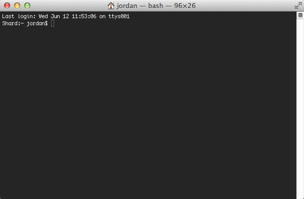

# Uninstall Android Studio

### Terminal

All commands in this guide are done inside of the `Terminal`.

<br />

To open the `Terminal` `hold down` the `Cmd-key` then hit the `Spacebar` to search using `Spotlight`.

<br />


<br />
<br />

Type the word `terminal` and hit the `Enter-key`. This will open a new `Terminal` window.





### Uninstall Commands

In the `Terminal` run following commands one at a time.

```bash {.copy-clip}
rm -Rf /Applications/Android\ Studio.app

rm -Rf ~/Library/Preferences/AndroidStudio*

rm -Rf ~/Library/Preferences/com.google.android.*

rm -Rf ~/Library/Preferences/com.android.*

rm -Rf ~/Library/Application\ Support/AndroidStudio*

rm -Rf ~/Library/Logs/AndroidStudio*

rm -Rf ~/Library/Caches/AndroidStudio*

rm -Rf ~/.AndroidStudio*

rm -Rf ~/AndroidStudioProjects

rm -Rf ~/.gradle

rm -Rf ~/.android

rm -Rf ~/Library/Android*
```
