# Setting up React Native development environment

---

## React Native for iOS `IS NOT` supported on Windows and Linux

 A `Mac` desktop or `Macbook Pro` laptop is required to build apps using that use native `iOS` code.

 ---

## Terminal

> All commands and outputs shown in this guide are done inside of the `Terminal`.


#### Start Terminal

To start/open the `Terminal` click on the `magnifying glass icon` in the `upper right corner` of the `menu bar` to open the `Spotlight` search box.

<br />

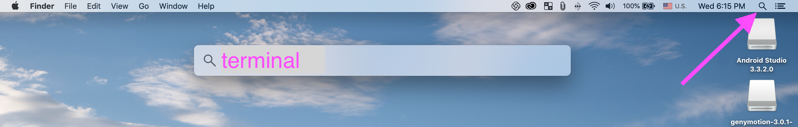

<br />
<br />

Type the word `terminal` into the `Spotlight` search box and hit the` Enter-key`.

<br />


<br />
<br />

All `commands` in this installation guide are done in the `Terminal`.

---

# Installing dependencies for iOS and Android


> You will need `Xcode`, `Node`, `Watchman` the `React Native CLI`, `Python2`, and a `JDK` (Java Development Kit).

> While you can use the editor of your choice to develop your app, you will need to install `Android Studio` in order to set up the necessary tooling to build and run your `React Native` app for `Android`.

> I also reccomend using `Homebrew` to install `Node` and `Watchman`.


### Homebrew

Check if `Homebrew` is installed.

```bash {.copy-clip}
brew --version
```

<div class='md-label md-label-output'>If <span class='md-key'>Hombrew</span> is installed you will see something similar to the following:</div>

```bash {.copy-clip .md-output}
Homebrew 2.0.5
Homebrew/homebrew-core (git revision 0548; last commit 2019-03-23)
Homebrew/homebrew-cask (git revision 4e0d7; last commit 2019-03-23)
```

If `Homebrew` `IS NOT` installed use the [Install Homebrew](https://brew.sh/) instruction guide.


### Xcode

Check if you have `Xcode` is installed.

```bash {.copy-clip}
 xcodebuild -version
```

Make sure `Xcode` is `version 9.4` or higher.

```bash {.copy-clip .md-output}
Xcode 10.1
```

The easiest way to `install` or `update` `Xcode` is via the [Mac App Store](https://itunes.apple.com/us/app/xcode/id497799835?mt=12). Installing `Xcode` will also install the `iOS Simulator` and all the necessary tools to build your `iOS` app.

### Command Line Tools

Open `Xcode`, then choose `Preferences` from the `Xcode` menu. 

<br />

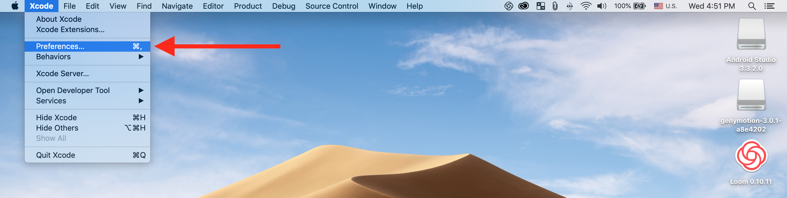

<br />
<br />

Go to the `Locations` panel and install the tools by selecting the most recent version in the `Command Line Tools dropdown`.

<br />


### Node

Check if `Node` is installed.

```bash {.copy-clip}
node --version
```

If you have already installed `Node` on your system, make sure it is `version 10.0 or newer`.

```bash {.md-output}
v11.11.0
```

If `Node` is not `version 10.0` or higher use `Homebrew` to upgrade.

```bash {.copy-clip}
brew upgrade node
```

If `Node` `IS NOT` installed use `Homebrew` to install.

```bash {.copy-clip}
brew install node
```

### Python

Check if `Python` is installed.

```bash {.copy-clip}
python --version
```

<div class='md-label md-label-output'>If <span class='md-key'>Python</span> is installed make sure it is <span class='md-key'>version 2</span> or higher.</div>

```bash {.copy-clip .md-output}
Python 2.7.16
```

If `Python` `IS NOT` installed or the current version is not `2` or higher use `Homebrew` to install or upgrade.

```bash {.copy-clip}
brew install python2
```


### Watchman

[Watchman](https://facebook.github.io/watchman) is a tool by Facebook for watching changes in the filesystem. It is highly recommended you install it for better performance.

```bash {.copy-clip}
brew install watchman
```

### The React Native CLI

Globally install the React Native CLI (command line interface.)

```bash {.copy-clip}
npm install -g react-native-cli
```


--- 


## Java Development Kit

React Native requires a recent version of the `JDK` (Java Development Kit). 

<br />

Check if `Java` is installed.

```bash {.copy-clip}
java -version
```

<div class='md-label md-label-output'>If <span class='md-key'>Java</span> is installed you will see the following ouput.</div>

```bash {.copy-clip .md-output}
openjdk version "1.8.0_202"
OpenJDK Runtime Environment (AdoptOpenJDK)(build 1.8.0_202-b08)
OpenJDK 64-Bit Server VM (AdoptOpenJDK)(build 25.202-b08, mixed mode)
```

<br />

If `Java` `IS NOT` installed you can [Download and install Oracle JDK 8](http://www.oracle.com/technetwork/java/javase/downloads/jdk8-downloads-2133151.html) if needed. You can also use [OpenJDK 8](http://openjdk.java.net/install/) as an alternative.


---

# Android development environment

Setting up your `development environment` for `Android` can be precarious even for an experience `React Native` developer, therefore please make sure to carefully follow the `Install Android Studio` steps below.

## Install Android Studio

`Android Studio` installs the latest `Android SDK` which is required to build and run your app on an `Android Virtual Device`.

<br />

### 1. Download the Android Studio Installer for macOS


Visit [Android Studio for Mac](https://developer.android.com/studio/index.html) to download the `Android Studio Installer`.

<br />

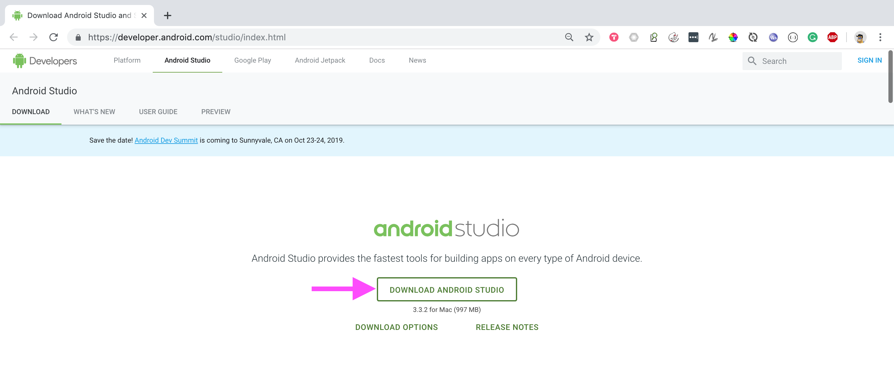

<br />
<br />

Save the `DMG file` to the `Downloads` directory.

<br />

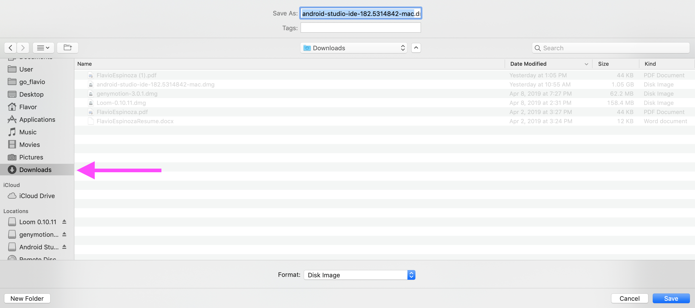

<br />
<br />


### 2. Launch Installer

When the download is complete `double-click` the `DGM file` to launch the installer.

<br />


<br />
<br />


Drag the `Android Studio Icon`into the `Applications` folder.


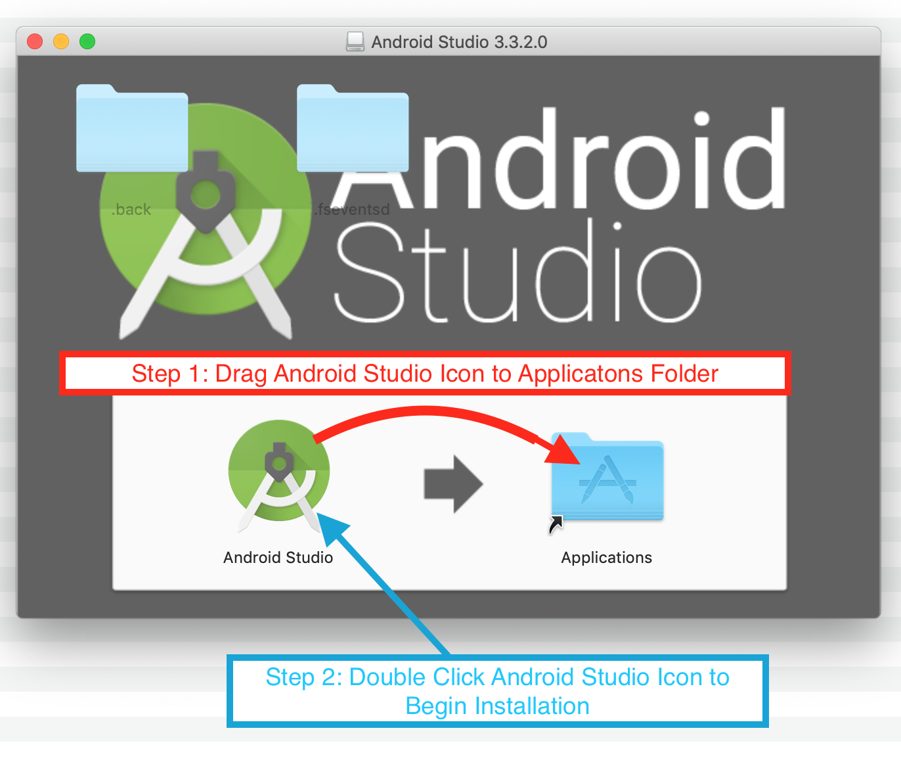

<br />

`Double-click` the `Android Studio Icon` to start the install process.

<br />
<br />


### 3. Install

Other than the steps `Complete Installation` and `Install Type` and `Downloading Components` you can just follow instructions during each step.

<br />

<div class='md-label md-label-output'>

#### Complete Installation
<br />

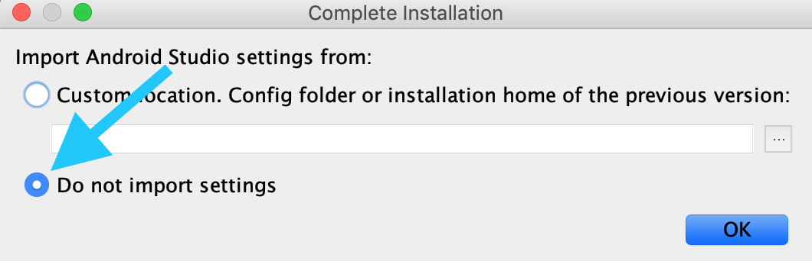

<br />
<br />
<br />


#### Install Type

<br />

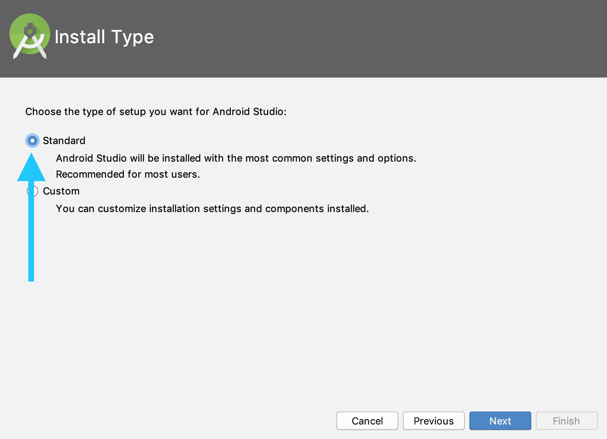

<br />
<br />


#### Downloading Components


You may get an alert that the `HAXM Installation` wants to make changes.  

<br />

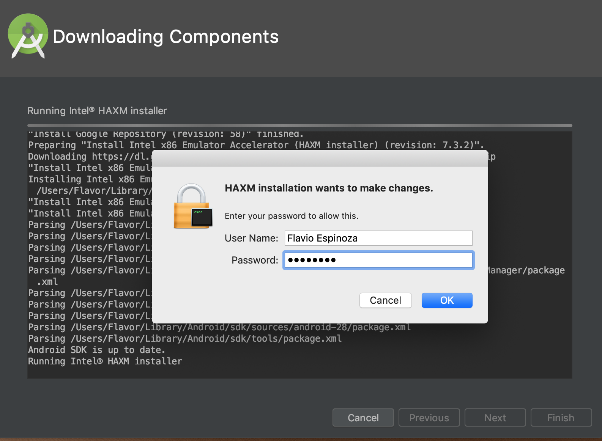

<br />
<br />

If this happens enter your `password` and hit `ok`.

<br />

When the **`Downloading Components`** step is complete click `Finish`

<br />

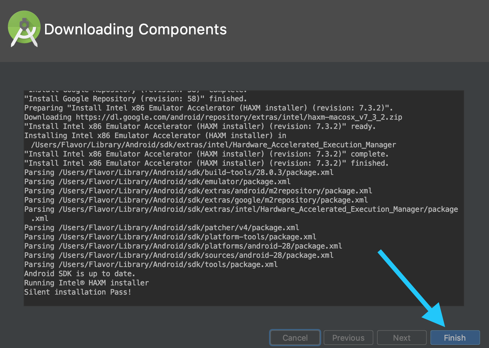

<br />
<br />


#### Install Complete
When the installation is complete you will see a `Welcome to Android Studio` dialog.

<br />

Under the `Android Studio` menu select `Quit Android Studio`.

<br />


<br />
<br />
<br />

</div>


### 4. Set Android Home Environment variable
The React Native tools require some environment variables to be set up in order to build apps with native code.

<br />

Open `.bash_profile` with the `Nano` editor.

```bash {.copy-clip}
sudo nano ~/.bash_profile
```

Add the following to the file.

```bash
export ANDROID_HOME=$HOME/Library/Android/sdk
export PATH=$PATH:$ANDROID_HOME/emulator
export PATH=$PATH:$ANDROID_HOME/tools
export PATH=$PATH:$ANDROID_HOME/tools/bin
export PATH=$PATH:$ANDROID_HOME/platform-tools
```

<br />

Press `Ctrl + X` to exit file

<br />

**You will be asked if you want to save changes.**

<br />


<br />
<br />

Press `Y-key` once.

<br />

Press `Enter-key` once.

<br />


### 5. Reload .bash_profile

You will need to `exit` and then `restart` the `Terminal` to implement the changes you made in the `.bash_profile`.  This is required so that the `ANDROID_HOME` environment variable changes to take effect.

<br />

**NOTE:** Some installation guides will tell you to reload the `.bash_profile` with the following command:

```bash {.copy-clip}
source ~/.bash_profile
```

I don't recommend this because your `bash` setup may use the `.bashrc` as the main source.  If this is the case you could seriously damage your `bash` setup by setting the source to the `.bash_profile`.

<br/>

Again, simply `exit` and then `restart` the `Terminal` for the `ANDROID_HOME` environment variable changes to take effect.

<br /> 
<br /> 

### 6. Verify Android Home Environment Variable

Check the `ANDROID_HOME` environment variable to make sure the changes took effect.

```bash {.copy-clip}
echo $ANDROID_HOME
```

<div class='md-label md-label-output'>You should see something like this.</div>

```bash {.copy-clip .md-output}
/Users/YOUR_USERNAME/Library/Android/sdk
```

 <br /> 
<br /> 

---

# Genymotion Android Emulator

> I highly recommend using [Genymotion](https://www.genymotion.com/) as your `Android emulator`. The emulator available in `Android Studio` has a very limited selection of devices that you can run as an `Android Virtual Device`. 


[Genymotion](https://www.genymotion.com/) has an extensive selection of `Android devices` and `Android API versions` to choose from. Although [Genymotion](https://www.genymotion.com/) is a paid service, they do have a [free trial](https://www.genymotion.com/account/create/) that you can use after the trial period is over if you select the option that you are using it for personal use.

<br />

Below are the steps to setup `Genymotion` on `macOS`.

<br />

### 1. Genymotion Registration

[Register a new Genymotion account](https://www.genymotion.com/account/create/)

<br />

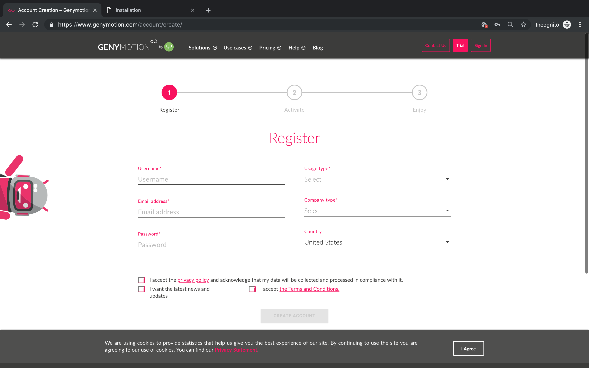

<br />
<br />

### 2. Install Genymotion

Follow the [Genymotion installation guide](https://docs.genymotion.com/latest/Content/01_Get_Started/Installation.htm) for `macOS`.

<br />

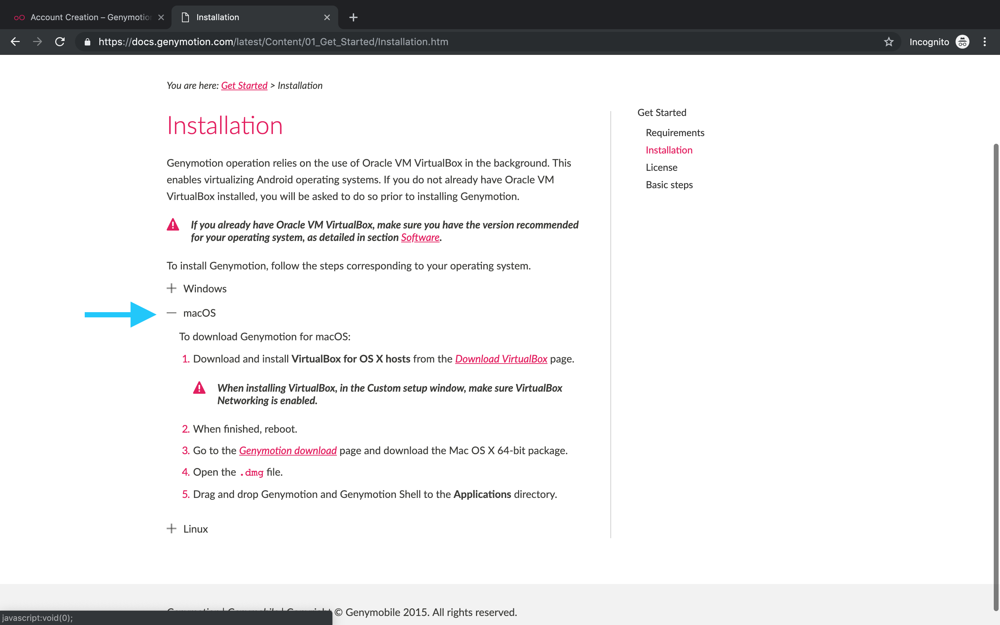

<br />
<br />

### 3. Open Genymotion
Click the `Genymotion` app icon in the `Applications` directory.

<br />

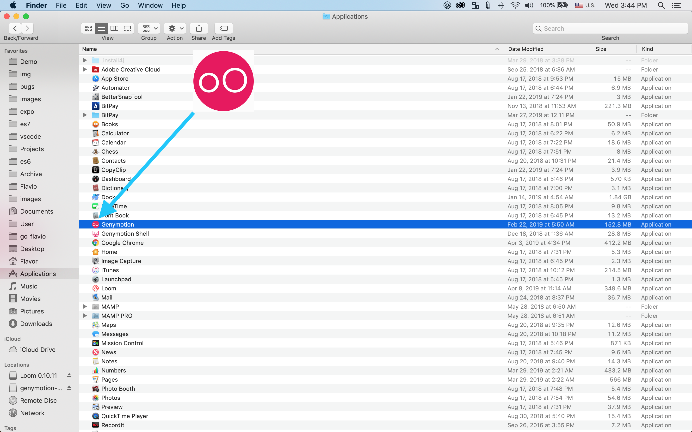

<br />
<br />

### 4. Login
When you first open `Genymotion` you will be prompted to signin with the `Username` and `Password` you setup during `Registration`.

<br />

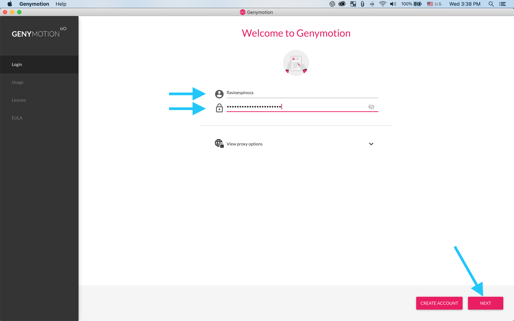

<br />
<br />
<br />

### 5. Select Android Device
`Search` for your prefered `Android device` and then `install` it.

<br />

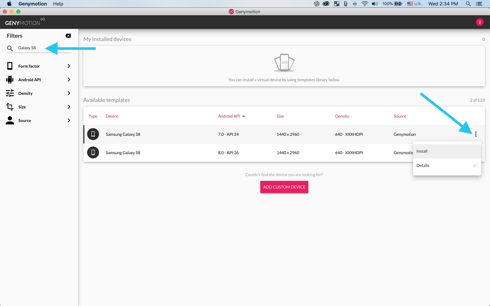

The device selected will be your `Android Virtual Device` which is run through the `Genymotion Android emulator`.

<br />
<br />
<br />

### 6. Start Android Device
Starting the device will take a few minutes to boot up.

<br />

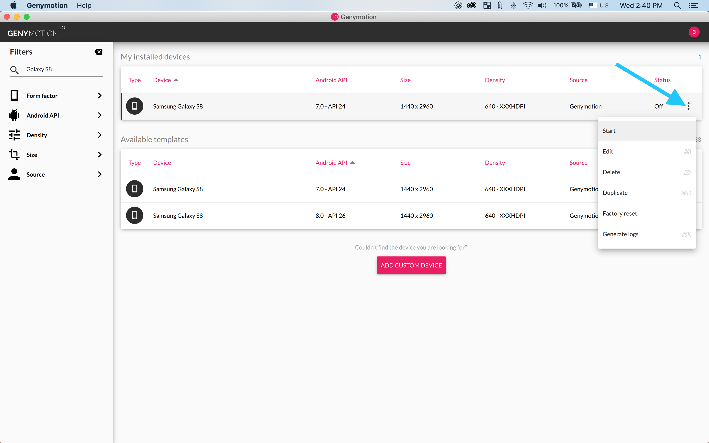

<br />
<br />

When the device is up and running you will see an `Android Virtual Device` on the desktop and that its `Status` is `On`.

<br />

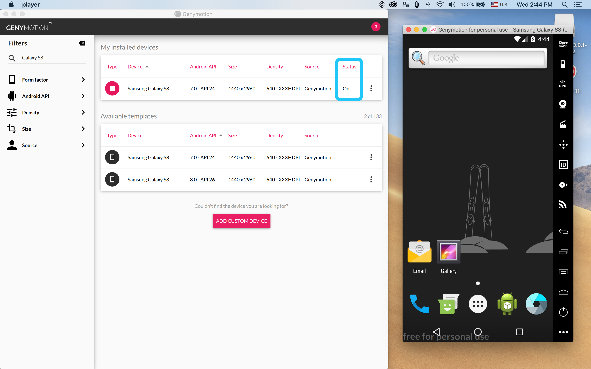

<br />
<br />
<br />

### 7. Verify Android Virtual Device is Running  
Run the follwing command in the `Terminal` to verify that the `Android Virtual Device` can be seen by your `development environment`.

```bash {.copy-clip}
adb devices
```

<div class='md-label md-label-output'>You should see a list of device IP addresses.</div>

```bash {.copy-clip .md-output}
List of devices attached
192.168.56.110:5555	device
```
If the there are no IP addresses shown close down all applications and restart you computer.  This is rare but sometimes the `development environment` cannot see the `Android Virtual Device's` IP adress.


---

# Create new React Native App

Use the `React Native CLI` to generate a new `React Native` project called `AwesomeProject` using `TypeScript`.

```bash {.copy-clip}
react-native init AwesomeProject
```

---

# Run React Native App

CD into your `React Native` project directory.

```bash {.copy-clip}
cd AwesomeProject
```

<br />

### Run iOS

Use the following command to run the app in the `iOS Simulator` that is part of `Xcode`.

```bash
react-native run-ios
```

You should see your new app running in the iOS Simulator shortly.

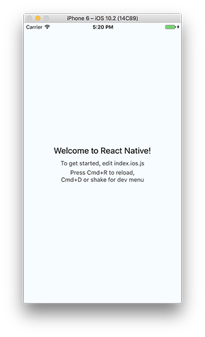

If you can't get this to work, see the [Troubleshooting](https://facebook.github.io/react-native/docs/troubleshooting) page.

<br />

### Run Android

Use the following command to run the app on the `Android Virtual Device` that you setup and started in `Genymotion`.

```bash
react-native run-android
```

If everything is set up correctly, you should see your new app running in your Android emulator shortly.


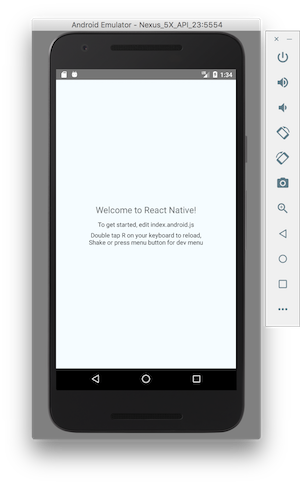

If you can't get this to work, see the [Troubleshooting](https://facebook.github.io/react-native/docs/troubleshooting) page.

---

# App Development

Now that you have successfully run the app, let's modify it. Open the `App.js` file in your code editor of choice and edit some lines.

### iOS Update

Hit `⌘R` in your `iOS emulator` to reload the app and see your changes!


### Android Update

Press the `R-key` `twice` (RR) in your `Android emulator` or select `Reload` from the Developer Menu `(Ctrl + M)` to see your changes!

---


# That's it!

Congratulations! You've successfully `setup`, `run` and `modified` your first `React Native` app.

